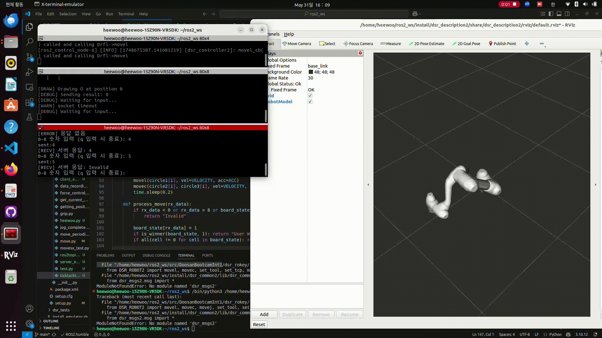

# 🤖 틱택토 로봇 게임 (Tic-Tac-Toe Robot Game)

본 프로젝트는 **두산 로봇 API (DR SDK)**와 **ROS 2**를 활용한 다양한 로봇 제어 예제를 포함하고 있으며,  
특히 다음과 같은 실험을 포함합니다:

- 틱택토 로봇 게임  
- 힘 제어 기반 블록 조작  
- GUI 기반 로봇 위치 제어

틱택토 게임은 사용자가 GUI로 수를 두고, 로봇이 실제로 'O' 표시를 그리는 인터랙티브 시스템입니다.

---

## 📁 프로젝트 구조

```
.
├── README.md
└── src
    ├── LICENSE
    └── rokey
        ├── package.xml
        ├── resource/
        ├── rokey/
        │   ├── basic/
        │   │   ├── block.py              # 순응제어 + 진동 기반 블록 파지
        │   │   ├── force_control.py      # 힘 조건 만족 시 멈춤
        │   │   ├── get_current_pos.py    # 현재 위치 GUI 출력
        │   │   ├── getting_position.py   # 이동 후 위치 출력
        │   │   ├── grip.py               # 그리퍼 반복 동작
        │   │   ├── jog_complete.py       # 조인트/직교 이동 GUI
        │   │   ├── move.py               # 기본 위치 이동
        │   │   ├── move_periodic.py      # 회전 진동 제어
        │   │   ├── movesx_test.py        # 사인 궤적 이동
        │   │   ├── ros2topictic.py       # ROS2 기반 틱택토 노드
        │   │   ├── server_example.py     # 랜덤 응답 테스트 서버
        │   │   ├── test.py               # 틱택토 로직 + movec 원 그리기
        │   │   └── ttt_sim.py            # 가상 모드 틱택토 서버
        │   └── ticktacktoe/
        │       ├── gui_ex.py             # GUI 클라이언트 (Tkinter)
        │       └── ttt_number.py         # 틱택토 실행 서버
        ├── setup.cfg
        └── setup.py
```

---

## 🔧 사전 준비 사항

- Python 3.8 이상  
- ROS 2 Foxy 또는 이후 버전  
- 두산 로봇 제어 패키지 (DR SDK)  
- 실제 로봇 또는 가상 제어 환경  
- `tkinter` (GUI용: Ubuntu → `sudo apt install python3-tk`)

---

## 🕹 주요 실행 예제

### 🎮 틱택토 로봇 게임 실행

```bash
# 로봇 서버 실행
ros2 run rokey ttt_number

# GUI 실행
python3 src/rokey/rokey/ticktacktoe/gui_ex.py
```

- 하드 모드 (AI) / 이지 모드 (랜덤)
- GUI에서 클릭 → 로봇이 최적 위치에 원 그림
- 게임 리셋 / 보드 지우기 / 승리 댄스 동작 포함

---

## 🎥 데모 영상

[](https://youtu.be/VpZkLcmdUkc)

> 실제 로봇이 보드에 'O'를 그리고 반응하는 모습을 확인할 수 있습니다.

---

## 🔌 소켓 통신 프로토콜

### 📤 클라이언트 → 서버
| 명령어 | 설명 |
|--------|------|
| `-1\n` | 하드 모드 선택 |
| `-2\n` | 이지 모드 선택 |
| `0~8\n` | 사용자 수 입력 |
| `9\n` | 게임 리셋 요청 |
| `exit\n` | 서버 종료 요청 |

### 📥 서버 → 클라이언트
| 응답값 | 의미 |
|--------|------|
| `0~8` | 로봇이 둔 위치 |
| `10` | 로봇 승리 |
| `11` | 무승부 |
| `12` | 사용자 승리 |
| `-99` | 예외 or 잘못된 명령 |

---

## 📐 로봇 제어 구조 (틱택토)

- 각 위치는 `posx([x, y, z, rx, ry, rz])` 형식
- `movec()`로 3점 원 그리기 수행
- `draw_line()`, `ereasing()`으로 보드선 및 리셋 동작 수행
- `robot_dance()`로 승리 시 세레모니 동작

---

## 🧩 basic 파일 미니 프로젝트  


### 시뮬레이션 상의 틱택토 게임 구현 (test.py / ttt_sim.py)


### 힘제어 순응제어 활용하여 블록 크기 재고 크기 순으로 정렬 (heewoo.py)

### 움직임 테스트 파일들 

## 📡 ROS2 통신 기능

- `/dsr01/msg/current_posx`, `/dsr01/msg/joint_state` 구독
- `/tictactoe_input` 구독을 통한 틱택토 입력 처리
- `SetRobotMode` 서비스 호출 예제 포함

---


## ✨ 향후 확장 가능성

- 🔊 음성 명령 기반 게임 진행  
- 🌐 Flask + WebSocket 기반 웹 게임 서비스  
- 🧠 강화학습 기반 로봇 학습형 틱택토 AI

---

## 📄 라이선스

본 프로젝트는 **Apache 2.0 License** 하에 배포됩니다.
